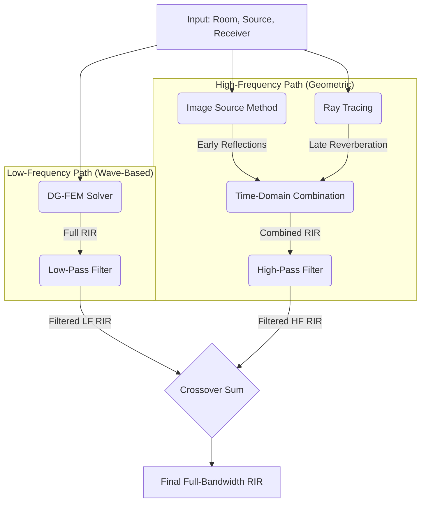

# Hybrid DG-FEM Engine

This engine provides a hybrid simulation approach that combines the accuracy of wave-based solvers at low frequencies with the efficiency of geometrical acoustics methods at high frequencies.

## Features

- **Broadband Accuracy**: Achieves physically accurate simulation results across the entire audible frequency spectrum.
- **Wave-Based Low Frequencies**: Uses the Discontinuous Galerkin Finite Element Method (DG-FEM) to accurately model wave phenomena like diffraction and modal behavior at low frequencies.
- **Geometrical High Frequencies**: Employs a combination of the Image Source Method (ISM) for precise early reflections and Ray Tracing for dense late reverberation at high frequencies.
- **Frequency-Domain Crossover**: The results from the low-frequency and high-frequency solvers are combined using a Linkwitz-Riley crossover filter for a seamless transition.

## Block Diagram



## Methodology

The simulation process is as follows:

1.  **Low-Frequency Simulation**: A full Room Impulse Response (RIR) is computed using the DG-FEM solver. This RIR is then low-pass filtered.
2.  **High-Frequency Simulation**:
    -   The Image Source Method is used to compute the early part of the RIR.
    -   Ray Tracing is used to compute the late reverberant tail.
    -   These two are combined in the time domain with a smooth cross-fade to create a complete high-frequency RIR.
    -   The resulting RIR is high-pass filtered.
3.  **Final Combination**: The filtered low-frequency and high-frequency RIRs are summed together to produce the final, full-bandwidth RIR.

## Usage

```python
from rayroom.room.base import Room, SoundSource, Microphone
from rayroom.engines.hybrid_dgfem.hybrid_dgfem import HybridDGFEMMethod, HybridDGFEMConfig
from rayroom.engines.dgfem.dgfem import DGFEMConfig

# 1. Create a room
room = Room([5, 4, 3])
room.add_source(SoundSource([2, 2, 1.5]))
room.add_mic(Microphone([4, 3, 1.5]))

# 2. Configure the hybrid solver
# This includes setting the crossover frequency and configuring sub-solvers.
hybrid_config = HybridDGFEMConfig(
    crossover_freq=400,
    dgfem_config=DGFEMConfig(
        polynomial_order=2,
        mesh_resolution=0.6
    ),
    raytracer_config={'num_rays': 20000}
)

# 3. Initialize and run the solver
solver = HybridDGFEMMethod(room, hybrid_config)
rir = solver.compute_rir(duration=1.0)

# The result is the full-bandwidth RIR
print(f"RIR computed: {len(rir)} samples.")
```

## When to Use

This hybrid engine is the most comprehensive and physically accurate method available in this library. It should be used when:

-   High accuracy is required across the full frequency range.
-   The room size and complexity are manageable for the DG-FEM component.
-   The computational resources are available, as this is the most demanding simulation method.
