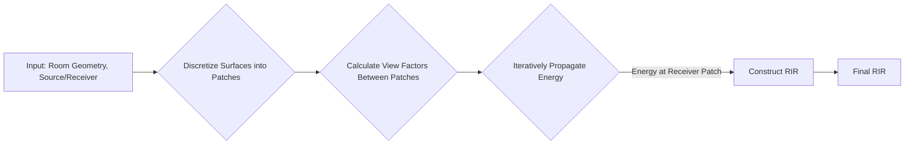

# Acoustic Radiosity Methodology

Acoustic Radiosity is an energy-based simulation technique adapted from the field of thermal engineering and computer graphics. Unlike ray-based methods that track individual sound particles, radiosity models the exchange of acoustic energy between surfaces in a closed environment. It is particularly well-suited for simulating the late, diffuse reverberation field in a room, where the sound energy is evenly distributed and arriving from all directions.

The core idea is to discretize all surfaces in the room (walls, furniture) into a finite number of smaller elements called "patches." The simulation then calculates how much acoustic energy is transferred from each patch to every other patch. This results in a much smoother and more perceptually natural reverberation tail compared to the stochastic noise that can be present in ray tracing.

### Block Diagram



## Core Equations & Principles

The fundamental equation of acoustic radiosity describes the "shooting" of sound energy from a patch $i$. The total energy $B_i$ leaving patch $i$ per unit area is the sum of its self-emitted energy $E_i$ (from direct sound sources) and the reflected energy it receives from all other patches $j$ in the scene:

$$
B_i = E_i + \rho_i \sum_{j=1}^{N} B_j F_{ij}
$$

where:
-   $B_i$ is the radiosity of patch $i$ (Energy/Area).
-   $E_i$ is the excitance of patch $i$ (Energy/Area) from direct sources.
-   $\rho_i$ is the reflectivity of patch $i$, where $\rho = 1 - \alpha$ ($\alpha$ is the absorption coefficient).
-   $B_j$ is the radiosity of patch $j$.
-   $F_{ij}$ is the **view factor** (or form factor) from patch $i$ to patch $j$.

### The View Factor $F_{ij}$

The view factor is the crucial geometric term that represents the fraction of energy leaving patch $i$ that arrives directly at patch $j$. For two differential patches $dA_i$ and $dA_j$, it is given by:

$$
F_{d A_i \rightarrow d A_j} = \frac{\cos(\theta_i) \cos(\theta_j)}{\pi r^2} H_{ij} d A_j
$$

-   $\theta_i$ and $\theta_j$ are the angles between the patch normals and the line connecting them.
-   $r$ is the distance between the patches.
-   $H_{ij}$ is a visibility term (1 if patches can see each other, 0 otherwise).

Solving the system of linear equations for all patches provides the steady-state energy distribution. For a time-domain impulse response, the simulation is run iteratively, propagating energy between patches over discrete time steps.

## Implementation Details

-   **Patch Discretization:** The accuracy of the simulation is highly dependent on the size of the patches. Smaller patches provide more detail but significantly increase computational cost. A `patch_size` parameter controls this trade-off.
-   **Energy Propagation:** The simulation is time-dependent. In each time step, every patch "shoots" its energy to all other visible patches. The energy arrives at the other patches after a delay corresponding to the travel time.
-   **Hybrid Approach:** In practice, pure radiosity struggles with the initial specular reflections. Therefore, this engine is often implemented as a hybrid method, using the **Image Source Method (ISM)** to generate the early, distinct reflections, and radiosity to model the subsequent diffuse tail.

## Seminal Papers

1.  **Goral, C. M., Torrance, K. E., Greenberg, D. P., & Battaile, B. (1984).** *Modeling the Interaction of Light Between Diffuse Surfaces*. ACM SIGGRAPH Computer Graphics, 18(3), 213–222.

```bibtex
@article{goral1984modeling,
  title={Modeling the interaction of light between diffuse surfaces},
  author={Goral, Cindy M and Torrance, Kenneth E and Greenberg, Donald P and Battaile, Bennett},
  journal={ACM SIGGRAPH computer graphics},
  volume={18},
  number={3},
  pages={213--222},
  year={1984},
  publisher={ACM New York, NY, USA}
}
```

2.  **Nosal, E. M., Hodgson, M., & Ashdown, I. (2004).** *Improved algorithms and methods for room sound-field prediction by acoustical radiosity in arbitrary polyhedral rooms.* The Journal of the Acoustical Society of America, 116(2), 970-980.

```bibtex
@article{nosal2004improved,
  title={Improved algorithms and methods for room sound-field prediction by acoustical radiosity in arbitrary polyhedral rooms},
  author={Nosal, Eva-Marie and Hodgson, Murray and Ashdown, Ian},
  journal={The Journal of the Acoustical Society of America},
  volume={116},
  number={2},
  pages={970--980},
  year={2004},
  publisher={Acoustical Society of America}
}
```

3.  **Tsingos, N., & Gascuel, J. D. (1997).** *A general model for the simulation of room acoustics based on hierachical radiosity*. ACM SIGGRAPH 97 Visual Proceedings, 149.

```bibtex
@inproceedings{10.1145/259081.259236,
    author = {Tsingos, Nicolas and Gascuel, Jean-Dominique},
    title = {A general model for the simulation of room acoustics based on hierachical radiosity},
    year = {1997},
    isbn = {0897919211},
    publisher = {Association for Computing Machinery},
    address = {New York, NY, USA},
    url = {https://doi.org/10.1145/259081.259236},
    doi = {10.1145/259081.259236},
    booktitle = {ACM SIGGRAPH 97 Visual Proceedings: The Art and Interdisciplinary Programs of SIGGRAPH '97},
    pages = {149},
    location = {Los Angeles, California, USA},
    series = {SIGGRAPH '97}
}
```

