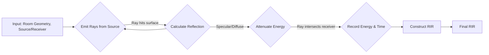

# Stochastic Ray Tracer Methodology

Acoustic Ray Tracing is a powerful simulation technique that models the propagation of sound by representing sound waves as a large number of discrete "rays." It is a geometric acoustics method, meaning it is most accurate at mid-to-high frequencies where the wavelength of sound is much smaller than the dimensions of the room. This engine is particularly effective at simulating the late reverberation tail of a Room Impulse Response (RIR), where the sound field is diffuse and composed of many overlapping reflections.

The core principle is to emit thousands of rays from a sound source in random directions. Each ray travels in a straight line until it intersects a surface. At each intersection, the ray's energy is attenuated based on the surface's acoustic properties, and a new direction is calculated for the reflected ray. The process is repeated until the ray's energy falls below a certain threshold or a maximum number of reflections is reached. The energy contributions of all rays that pass through a receiver volume are summed over time to construct the RIR.

### Block Diagram



## Core Equations & Principles

### 1. Ray Energy Attenuation

When a ray with energy $E_{i}$ hits a surface, its energy is reduced by two primary mechanisms:

-   **Absorption:** A portion of the energy is absorbed by the material. The reflected energy $E_{r}$ is scaled by the material's absorption coefficient $\alpha$:

    $E_r = E_i (1 - \alpha)$
    
-   **Geometric Spreading:** In a real environment, sound intensity decreases with the square of the distance from the source. In this ray tracer, this is implicitly handled by the decreasing density of rays as they travel away from the source.

### 2. Reflection Modeling

Upon hitting a surface, the ray's new direction is determined by the material's scattering coefficient $s$, which ranges from 0 (perfectly specular) to 1 (perfectly diffuse).

-   **Specular Reflection:** If the reflection is specular (a random number is less than $s$), the outgoing angle equals the incoming angle. The reflected vector $\mathbf{v}_r$ is calculated from the incident vector $\mathbf{v}_i$ and the surface normal $\mathbf{n}$ as:

    $\mathbf{v}_r = \mathbf{v}_i - 2 (\mathbf{v}_i \cdot \mathbf{n}) \mathbf{n}$

-   **Diffuse Reflection:** If the reflection is diffuse, the ray is scattered in a random new direction. A common and physically-based choice is to sample the new direction from a cosine-weighted distribution over the hemisphere defined by the surface normal, according to **Lambert's Cosine Law**.

## Implementation Details

-   **Receiver Model:** Receivers are modeled as spheres. A ray is considered "received" if its path intersects a receiver sphere. The energy and arrival time are then recorded in the corresponding time bin of the RIR.
-   **Air Absorption:** The energy loss of a ray as it travels through the air is a critical component. This implementation uses the **ISO 9613-1** standard, which provides a detailed model for frequency-dependent atmospheric attenuation as a function of temperature, humidity, and atmospheric pressure.
-   **Stochastic Process:** The initial directions of the rays from the source are typically sampled from a uniform spherical distribution to ensure isotropic emission. The entire process is stochastic, meaning that running the simulation multiple times with the same parameters will produce slightly different, but statistically similar, results.

## Seminal Papers

1.  **Krokstad, A., Strøm, S., & Sørsdal, S. (1968).** *Calculating the acoustical room response by the use of a ray tracing technique*. Journal of Sound and Vibration, 8(1), 118-125.

```bibtex
@article{krokstad1968calculating,
  title={Calculating the acoustical room response by the use of a ray tracing technique},
  author={Krokstad, Asbj{\o}rn and Strom, Staffan and S{\o}rsdal, Svein},
  journal={Journal of Sound and Vibration},
  volume={8},
  number={1},
  pages={118--125},
  year={1968},
  publisher={Elsevier}
}
```

2.  **Glassner, A. S. (Ed.). (1989).** *An introduction to ray tracing*. Morgan Kaufmann.

```bibtex
@book{glassner1989introduction,
  title={An introduction to ray tracing},
  author={Glassner, Andrew S},
  year={1989},
  publisher={Morgan Kaufmann}
}
```

3.  **Savioja, L., & Svensson, U. P. (2015).** *Overview of geometrical room acoustic modeling techniques*. The Journal of the Acoustical Society of America, 138(2), 708-730.

```bibtex
@article{savioja2015overview,
  title={Overview of geometrical room acoustic modeling techniques},
  author={Savioja, Lauri and Svensson, U Peter},
  journal={The Journal of the Acoustical Society of America},
  volume={138},
  number={2},
  pages={708--730},
  year={2015},
  publisher={AIP Publishing}
}
```
