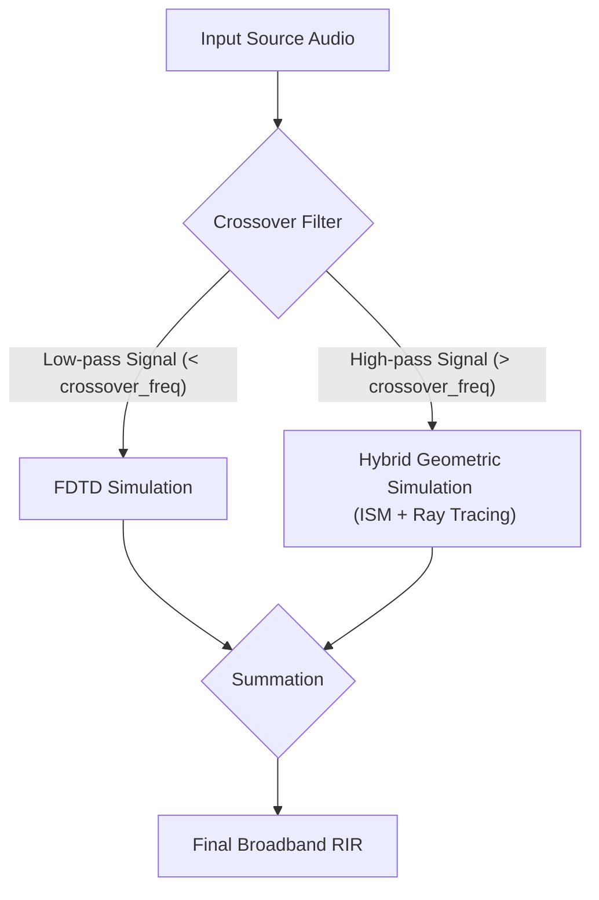

# Spectral Renderer Methodology

The Spectral Renderer is the most advanced and physically accurate simulation engine in `RayRoom`. It is a hybrid model that acknowledges a fundamental principle of acoustics: the behavior of sound is highly dependent on its frequency.
-   **Low Frequencies:** Sound waves have long wavelengths, causing them to bend around objects (diffraction) and create complex patterns of constructive and destructive interference (standing waves). These phenomena cannot be accurately modeled by geometric methods.
-   **High Frequencies:** Sound waves have short wavelengths and behave much like rays of light, traveling in straight lines and reflecting off surfaces. Geometric methods are highly efficient and accurate in this regime.

The Spectral Renderer leverages the best of both worlds by splitting the audio spectrum at a user-defined `crossover_freq`. It simulates the low-frequency and high-frequency components separately and then combines them to produce a single, full-bandwidth Room Impulse Response (RIR).

-   **Below Crossover:** The engine uses a **Finite Difference Time Domain (FDTD)** solver, which directly simulates the acoustic wave equation on a 3D grid. This captures all wave-based phenomena with high fidelity.
-   **Above Crossover:** The engine uses the **Hybrid Geometric Renderer** (Image Source Method + Ray Tracing), which is computationally efficient and well-suited for the ray-like behavior of high-frequency sound.

## Core Equations & Principles

### 1. Finite Difference Time Domain (FDTD)

FDTD is a numerical analysis technique that solves the acoustic wave equation by discretizing both space and time. The room is represented as a 3D grid of points (voxels), and the sound pressure at each point is updated in discrete time steps. The core of the method is the linearized, lossless acoustic wave equation:

$$
\frac{\partial^2 p}{\partial t^2} = c^2 \nabla^2 p
$$

where:
-   $p$ is the acoustic pressure.
-   $t$ is time.
-   $c$ is the speed of sound.
-   $\nabla^2$ is the Laplace operator, representing the spatial derivatives.

This continuous equation is approximated using central finite differences, leading to an explicit update equation for the pressure $p$ at each grid point $(i, j, k)$ at time step $n+1$, based on its own previous state and the state of its neighbors.

### 2. Spectral Decomposition and Merging

The process involves several steps:
1.  **Filtering:** The input source audio is split into a low-pass and a high-pass signal using a crossover filter (e.g., a Linkwitz-Riley filter) at the `crossover_freq`.
2.  **Parallel Simulation:** The low-pass signal is used as input for the FDTD simulation. Simultaneously, the high-pass signal is used as input for the Hybrid Geometric simulation.
3.  **Recombination:** The two resulting impulse responses (one from FDTD, one from the geometric engine) are summed together to create the final broadband RIR.

### Block Diagram



## Implementation Details

-   **Voxelization:** The room geometry, including all objects and material properties, is discretized onto the 3D grid. This process is a key step that can affect the accuracy of the simulation.
-   **Boundary Conditions:** The interaction of sound waves with the room surfaces is handled by implementing impedance boundary conditions on the grid. This allows the model to account for the frequency-dependent absorption of the materials.
-   **Stability (Courant Condition):** For the FDTD simulation to be numerically stable, the time step $\Delta t$ and the spatial grid spacing $\Delta x$ must satisfy the Courant-Friedrichs-Lewy (CFL) condition:

    $c \Delta t \sqrt{\frac{1}{\Delta x^2} + \frac{1}{\Delta y^2} + \frac{1}{\Delta z^2}} \le 1$

-   **Dispersion:** At higher frequencies (relative to the grid spacing), the numerical simulation can introduce inaccuracies where waves of different frequencies travel at slightly different speeds. This is known as numerical dispersion and limits the maximum frequency that an FDTD grid can accurately simulate, reinforcing the need for a hybrid approach.

## Seminal Papers

1.  **Yee, K. S. (1966).** *Numerical solution of initial boundary value problems involving Maxwell's equations in isotropic media*. IEEE Transactions on Antennas and Propagation, 14(3), 302-307.

```bibtex
@article{yee1966numerical,
  title={Numerical solution of initial boundary value problems involving Maxwell's equations in isotropic media},
  author={Yee, Kane},
  journal={IEEE Transactions on antennas and propagation},
  volume={14},
  number={3},
  pages={302--307},
  year={1966},
  publisher={Ieee}
}
```

2.  **Botteldooren, D. (1995).** *Finite-difference time-domain simulation of low-frequency room acoustic problems*. The Journal of the Acoustical Society of America, 98(6), 3302-3308.

```bibtex
@article{botteldooren1995finite,
  title={Finite-difference time-domain simulation of low-frequency room acoustic problems},
  author={Botteldooren, Dick},
  journal={The Journal of the Acoustical Society of America},
  volume={98},
  number={6},
  pages={3302--3308},
  year={1995},
  publisher={Acoustical Society of America}
}
```

3.  **Kowalczyk, K., & Van Walstijn, M. (2010).** *Room acoustics simulation using 3-D compact explicit FDTD schemes.* IEEE Transactions on Audio, Speech, and Language Processing, 19(1), 34-46.

```bibtex
@article{kowalczyk2010room,
  title={Room acoustics simulation using 3-D compact explicit FDTD schemes},
  author={Kowalczyk, Konrad and Van Walstijn, Maarten},
  journal={IEEE Transactions on Audio, Speech, and Language Processing},
  volume={19},
  number={1},
  pages={34--46},
  year={2010},
  publisher={IEEE}
}
```

4.  **Savioja, L., & Svensson, U. P. (2015).** *Overview of geometrical room acoustic modeling techniques*. The Journal of the Acoustical Society of America, 138(2), 708-730.

```bibtex
@article{savioja2015overview,
  title={Overview of geometrical room acoustic modeling techniques},
  author={Savioja, Lauri and Svensson, U Peter},
  journal={The Journal of the Acoustical Society of America},
  volume={138},
  number={2},
  pages={708--730},
  year={2015},
  publisher={AIP Publishing}
}
```
